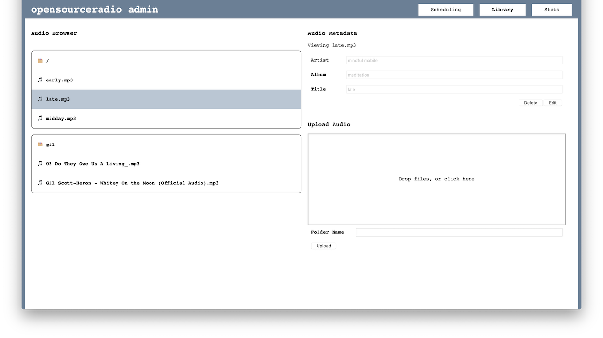

# opensourceradio 

a proof of concept for self hosting streaming radio.

[come and check it out!](http://radio.yomills.com)

## example




## usage

### setup

#### ffmpeg

before anything else, you'll need FFMPEG locally. if you don't already, run `brew install ffmpeg` to install it locally.

you may run into a somewhat-common issue of the install failing when building symlinks, which is [fixed in this GitHub thread](https://github.com/Homebrew/homebrew-core/issues/30652#issuecomment-410645836).

#### env files

in the client, server, admin, and stream directories, you'll find `.env.example` files. create a new `.env` file for each directory and copy the content of the `.env.example`.

#### audio files

to populate your radio stream, `mkdir stream/assets/audio` and fill the directory with mp3 files of your choosing.

### backend

the portion of the app runs the RTMP server, chat websockets, and API services for osr. it's currently configured to run on a sqlite database.

```
cd server
npm install
./node_modules/.bin/knex migrate:latest
node index.js
```

### stream

this is the ffmpeg process, it connects to the sqlite db to configure it's currently playing song and then broadcasts it's stream to the RMTP server. it can be started and stopped using the [admin](#admin) app.

### client

the front end of osr. [preview available here](http://radio.yomills.com)

```
cd client
npm install
npm start
```

### admin

The admin front end of osr. It can be accessed at `/admin`. This app provides a web interface for managing the stream. It allows you to:

- create schedules
- start/stop the stream
- upload and delete songs
- manage uploaded mp3s metadata
