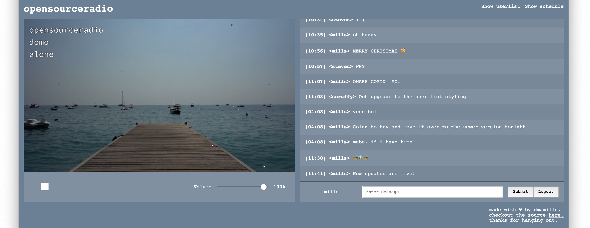

# opensourceradio

a proof of concept for self hosting streaming radio.

[come and check it out!](http://radio.yomills.com)

## example



## usage

### stream

before anything else, you'll need FFMPEG locally. if you don't already, run `brew install ffmpeg` to install it locally.

to start your radio stream, `mkdir stream/assets/audio` and populate the directory with mp3 files. then run:

```
cd stream
npm install
node index.js
```

### backend

```
cd server
npm install
./node_modules/.bin/knex migrate:latest
node index.js
```

### client

```
cd client
npm install
npm start
```
